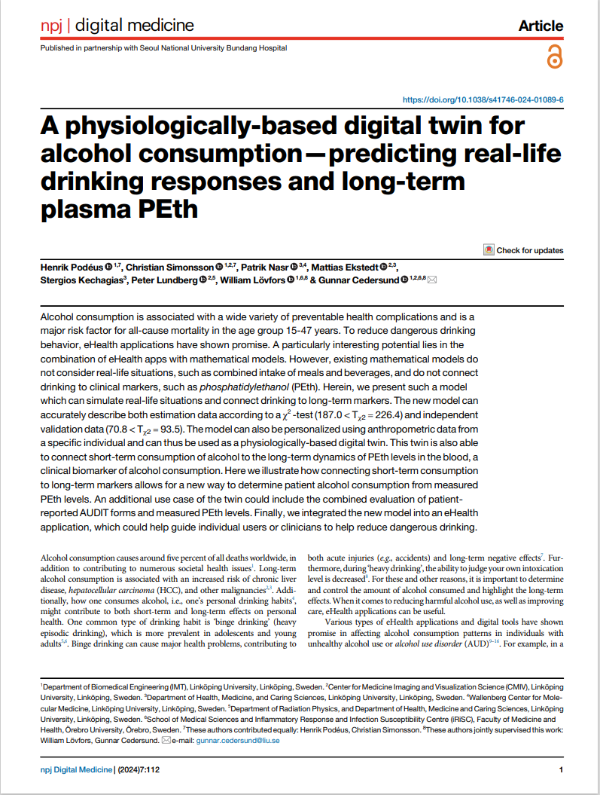

# A physiologically based digital twin for alcohol consumption

This repository contains the code for the eHealth application prototype featuring two published works:

## Paper 1: A Physiologically Based Digital Twin for Alcohol Consumption – Predicting Real-life Drinking Responses and Long-term Plasma PEth

<a href="https://doi.org/10.1038/s41746-024-01089-6">
	
</a>

The first publication, titled "A physiologically based digital twin for alcohol consumption – predicting real-life drinking responses and long-term plasma PEth", is [published in npj Digital Medicine](https://doi.org/10.1038/s41746-024-01089-6).

This work presents a detailed mechanistic model for alcohol dynamics, including gastric emptying, that can explain differences in alcohol absorption based on drink types and anthropometric characteristics. The model includes predictions for long-term clinical markers like phosphatidylethanol (PEth).

**Interactive demonstrations include:**
- Alcohol dynamics - Simulate drinks and observe BAC/breath alcohol
- Anthropometric differences in PEth - Explore how body characteristics affect PEth levels
- Drink type impact on PEth - Compare different drink types
- Evaluating reported PEth levels - Validate self-reported consumption against measurements

## Paper 2: Predicting Real-life Drinking Scenarios through a Physiological Digital Twin Incorporating Secondary Alcohol Markers  

The second work extends the model to include secondary alcohol metabolites: ethyl glucuronide (EtG), ethyl sulphate (EtS), and urine alcohol concentration (UAC). These biomarkers are important for detecting recent alcohol consumption and have different time profiles than blood alcohol.

**Interactive demonstrations include:**
- Alcohol secondary metabolites dynamics - Simulate and observe EtG, EtS, and UAC profiles
- Plausibility of behavior - Evaluate claimed drinking patterns against measured biomarker data

---

## Running the application

The prototype is hosted at [https://alcohol.streamlit.app](https://alcohol.streamlit.app), but can also be run locally. To do that, install the required packages listed in the `pyproject.toml` file: 

```bash
uv sync
```

Then run the application by running `uv run streamlit run Home.py` in the terminal. 

Please note that the application can take a few minutes to start up, primarily when running at [https://alcohol.streamlit.app](https://alcohol.streamlit.app), but also locally. Also note that a valid C-compiler is necessary for running the application locally.

The app was tested with Python 3.13, with the dependencies listed in `pyproject.toml` and `uv.lock`. 

## How to cite

If you use this application, please cite as:

### Paper 1

```text
Podéus H, Simonsson C, Nasr P, Ekstedt M, Kechagias S, Lundberg P, Lövfors W, Cedersund G (2024) A physiologically-based digital twin for alcohol consumption — predicting real-life drinking responses and long-term plasma PEth. npj Digital Medicine 7:112. https://doi.org/10.1038/s41746-024-01089-6
```

Or use the following bibtex entry:

```bibtex
@article{podeus_2024,
	title = {A physiologically-based digital twin for alcohol consumption — predicting real-life drinking responses and long-term plasma {PEth}},
	volume = {7},
	issn = {2398-6352},
	url = {https://doi.org/10.1038/s41746-024-01089-6},
	doi = {10.1038/s41746-024-01089-6},
	number = {1},
	journal = {npj Digital Medicine},
	author = {Podéus, Henrik and Simonsson, Christian and Nasr, Patrik and Ekstedt, Mattias and Kechagias, Stergios and Lundberg, Peter and Lövfors, William and Cedersund, Gunnar},
	month = may,
	year = {2024},
	pages = {112},
}
```

### Paper 2

citation coming soon